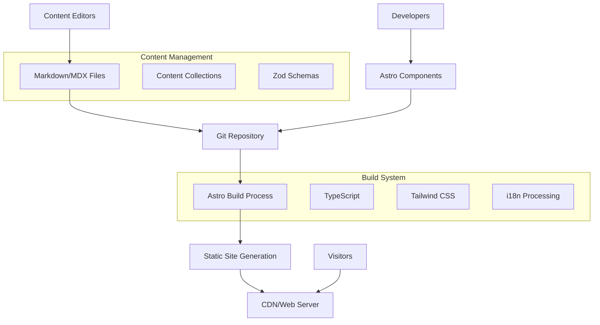
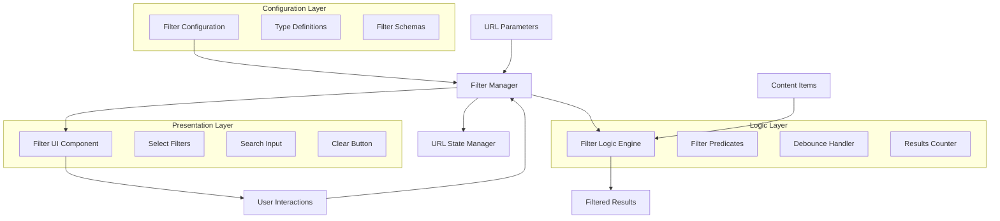

# EDT Research Website Design Document

## Overview

The EDT (Engineering Digital Twins) Research Program Website is a bilingual static website built with Astro.js that serves researchers, industrial partners, public institutions, and the general public. The design prioritizes performance, accessibility, and content management efficiency while providing an engaging user experience.

### Design Principles

- **Performance First**: Static site generation with optimized assets and sub-3-second load times
- **Accessibility by Design**: RGAA 4.1 AA compliance ensuring equal access for all users
- **Content-Driven Architecture**: Git-based content management with markdown/MDX files
- **Bilingual Excellence**: Seamless French/English experience with consistent navigation
- **Developer Experience**: Modern tooling with clear separation of concerns

## Architecture

### High-Level Architecture



### Technology Stack

- **Framework**: Astro.js 5.x with component islands architecture
- **Styling**: Tailwind CSS + Flowbite component library + Marianne font
- **UI Components**: Flowbite pre-built components (Cards, Navbar, Forms, Tables, etc.)
- **Content**: Astro Content Collections with Zod validation
- **Internationalization**: Astro i18n with prefix-based routing
- **Type Safety**: TypeScript with ES modules
- **Build**: Node.js with static site generation

### Flowbite Integration Strategy

The design leverages Flowbite's comprehensive component library to avoid recreating common UI patterns:

#### Core Flowbite Components Used

- **Navigation**: Navbar, Dropdown, Breadcrumb components
- **Content Display**: Card, Table, List, Timeline components  
- **User Interaction**: Button, Form, Search, Select, Toggle components
- **Layout**: Grid system, Hero, Footer components
- **Feedback**: Alert, Modal, Badge components
- **Data Presentation**: Pagination, Accordion components

#### Customization Approach

- **Tailwind Overrides**: Custom CSS classes to match Marianne font and brand colors
- **Component Wrapping**: Astro components that wrap Flowbite components with additional functionality
- **Accessibility Enhancement**: Additional ARIA attributes and keyboard navigation on top of Flowbite's base accessibility
- **Responsive Behavior**: Leverage Flowbite's responsive utilities with custom breakpoints as needed

#### Benefits

- **Rapid Development**: Pre-built, tested components reduce development time
- **Consistency**: Unified design language across all UI elements
- **Accessibility**: Built-in accessibility features as foundation
- **Maintenance**: Regular updates and bug fixes from Flowbite team
- **Documentation**: Comprehensive component documentation and examples

### Content Architecture

The content is organized using Astro Content Collections with a structured bilingual hierarchy that follows the established project structure:

```
src/content/
├── pages/                  # Main content pages with bilingual structure
│   ├── about/              # About pages (en.md, fr.md)
│   ├── contact/            # Contact information (en.md, fr.md)
│   ├── demo-center/        # Demo center (en.md, fr.md)
│   ├── focused-projects/   # Research projects
│   │   ├── fp1/            # Project 1 (en.md, fr.md)
│   │   ├── fp2/            # Project 2 (en.md, fr.md)
│   │   ├── fp3/            # Project 3 (en.md, fr.md)
│   │   ├── fp4/            # Project 4 (en.md, fr.md)
│   │   ├── fp5/            # Project 5 (en.md, fr.md)
│   │   ├── en.md           # Projects index (English)
│   │   └── fr.md           # Projects index (French)
│   ├── join-us/            # Career opportunities (en.md, fr.md)
│   ├── news/               # News events and press releases
│   │   ├── en.mdx          # News index (English)
│   │   └── fr.mdx          # News index (French)
│   ├── production/         # Production and outputs
│   │   ├── publications/   # Publications subsection (en.md, fr.md)
│   │   ├── platform/       # Platform documentation (en.md, fr.md)
│   │   ├── en.md           # Production index (English)
│   │   └── fr.md           # Production index (French)
│   ├── program/            # Program information (en.md, fr.md)
│   └── resources/          # Resources and tools (en.md, fr.md)
├── menu/                   # Navigation menus
│   ├── en.json             # English navigation
│   └── fr.json             # French navigation
├── events/                 # Events collection (separate from pages)
├── job-offers/             # Job offers collection to display in 'join-us'
└── publications/           # Publications collection (separate from pages)
```

This structure separates static page content from dynamic collections, enabling:

- **Static Pages**: Core program information with bilingual pairs
- **Dynamic Collections**: Publications, events, and job offers that populate list pages
- **Hierarchical Organization**: Nested content structure matching the 8-section navigation
- **Content Separation**: Clear distinction between page content and data collections

## Components and Interfaces

### Core Components

#### Layout Components

- **BaseLayout**: Master layout with meta tags, analytics, and accessibility features
- **Header**: Site branding with Flowbite Navbar component for responsive navigation
- **Footer**: Contact information using Flowbite Footer component with links and legal notices
- **Navigation**: Flowbite Navbar with Dropdown components for the 8-section menu system

#### Content Components

- **PageLayout**: Content wrapper using Flowbite Breadcrumb and custom TOC components
- **TileGrid**: Interactive front page using Flowbite Card components with hover effects
- **PublicationList**: Flowbite Table component with Search and Select filters for type/year filtering
- **JobOfferCard**: Flowbite Card components with Badge components for project categorization
- **EventCard**: Flowbite Timeline or Card components for chronological event display
- **ResourceCard**: Flowbite Card components with Badge components for type classification

#### Flowbite Integration Components

- **SearchBar**: Flowbite Search component for site-wide content search
- **FilterDropdowns**: Flowbite Select and Dropdown components for content filtering
- **LanguageToggle**: Flowbite Toggle component for accessible language switching
- **Pagination**: Flowbite Pagination component for long content lists
- **Alerts**: Flowbite Alert components for user feedback and error messages
- **Modals**: Flowbite Modal components for detailed content views
- **Buttons**: Flowbite Button components with consistent styling across the site
- **Forms**: Flowbite Form components for contact and search functionality

#### Accessibility Enhancements

- **SkipLinks**: Custom accessible navigation overlays on Flowbite components
- **FocusManagement**: Enhanced focus indicators building on Flowbite's base styles
- **ARIA Integration**: Custom ARIA attributes complementing Flowbite's accessibility features
- **TableOfContents**: Custom component using Flowbite List styling for structured navigation

## Job Offer Management System

### Overview

The job offer system has been redesigned to better reflect the academic hiring process by removing artificial deadlines and focusing on expected start dates and position availability. This approach provides more flexibility for both applicants and hiring managers.

### Key Design Changes

#### Expected Start Date Model

- **Flexible Format**: Supports various date formats including "Spring 2025", "Q2 2025", and specific dates
- **No Expiration**: Job offers remain active until explicitly marked as filled
- **Sorting**: Chronological organization based on expected start dates
- **Display**: Clear labeling of expected start dates in listings

#### Position Availability System

- **Boolean Status**: Simple filled/available status using boolean field
- **Conditional Rendering**: Apply buttons and contact information only shown for available positions
- **Status Indicators**: Clear visual indicators for filled positions
- **Project Page Filtering**: Different display logic for main listings vs. filled position tracking

#### Contact Management

- **Multiple Contacts**: Support for arrays of contact emails per position
- **Mailto Generation**: Automatic mailto link generation with all specified contacts
- **Fallback Handling**: Default contact information when none specified
- **Validation**: Email format validation for all contact addresses

#### Project Page Integration

- **Available Positions**: Main listings show only available (non-filled) positions
- **Filled PhD Tracking**: Separate component displays filled PhD positions for capacity tracking
- **Project Filtering**: Position filtering by project association (PC1-PC5)
- **Type-Specific Logic**: Different handling for PhD vs. other position types

### Component Architecture

#### JobOfferCard Component

```typescript
interface JobOfferCardProps {
  jobOffer: JobOffer;
  showApplyButton: boolean;
  showFilledIndicator: boolean;
  lang: 'en' | 'fr';
}
```

**Responsibilities:**

- Render job offer information with appropriate status indicators
- Conditionally display apply button based on filled status
- Generate mailto links using contacts array
- Display expected start date with flexible formatting

#### JobOfferList Component

```typescript
interface JobOfferListProps {
  jobOffers: JobOffer[];
  filterByProject?: string;
  showOnlyAvailable?: boolean;
  showOnlyFilled?: boolean;
  filterByType?: string;
  lang: 'en' | 'fr';
}
```

**Responsibilities:**

- Filter job offers based on availability, project, and type
- Sort by expected start date or other criteria
- Render appropriate job offer cards with correct props
- Handle empty states for filtered results

#### FilledPhDComponent

```typescript
interface FilledPhDComponentProps {
  project: string;
  jobOffers: JobOffer[];
  lang: 'en' | 'fr';
}
```

**Responsibilities:**

- Display only filled PhD positions for specified project
- Provide context about completed recruitments
- Show position details without apply functionality
- Integrate at bottom of project pages

### Data Flow

#### Content Processing

1. **Schema Validation**: Validate job offer frontmatter against updated schema
2. **Email Validation**: Verify all contact emails are valid format
3. **Boolean Validation**: Ensure filled field is proper boolean value
4. **Date Processing**: Handle flexible expected start date formats

#### Rendering Logic

1. **Availability Check**: Determine if position should show apply functionality
2. **Contact Processing**: Generate mailto links from contacts array
3. **Project Filtering**: Filter positions by project association
4. **Type Filtering**: Apply type-specific display logic

#### Project Page Logic

1. **Main Listings**: Show available positions only (filled = false)
2. **Filled PhD Section**: Show filled PhD positions only (filled = true AND type = 'phd')
3. **Project Association**: Filter by project tags (PC1, PC2, etc.)
4. **Fallback Handling**: Provide default behavior for missing data

### Content Collections Schema

#### Pages Collection

```typescript
const pagesSchema = z.object({
  title: z.string(),
  href: z.string(),
  lang: z.enum(['en', 'fr']),
  description: z.string().optional(),
  toc: z.boolean().default(false),
  lastModified: z.date().optional()
});
```

#### Publications Collection

```typescript
const publicationsSchema = z.object({
  title: z.string(),
  authors: z.array(z.string()),
  type: z.enum(['journal', 'conference', 'book', 'report']),
  year: z.number(),
  venue: z.string().optional(),
  doi: z.string().optional(),
  url: z.string().url().optional(),
  lang: z.enum(['en', 'fr'])
});
```

#### Job Offers Collection

```typescript
const jobOffersSchema = z.object({
  title: z.string(),
  project: z.enum(['PC1', 'PC2', 'PC3', 'PC4', 'PC5', 'General']),
  type: z.enum(['postdoc', 'phd', 'engineer', 'intern']),
  location: z.string(),
  expectedStartDate: z.string(), // Flexible format: "Spring 2025", "Q2 2025", "2025-06-01"
  filled: z.boolean().default(false), // Position availability status
  contacts: z.array(z.string().email()).optional(), // Multiple contact emails
  description: z.string(),
  requirements: z.array(z.string()),
  lang: z.enum(['en', 'fr'])
});
```

#### Events Collection

```typescript
const eventsSchema = z.object({
  title: z.string(),
  date: z.date(),
  type: z.enum(['conference', 'workshop', 'seminar', 'press']),
  location: z.string().optional(),
  description: z.string(),
  url: z.string().url().optional(),
  lang: z.enum(['en', 'fr'])
});
```

## Data Models

### Navigation Structure

The site implements an 8-section navigation menu:

1. **Program**: Goals, structure, committee, actions, partners, funder
2. **Projects**: PC1-PC5 with dedicated pages
3. **Production**: Publications (by type/year), platform links
4. **Demo Center**: Use cases, demonstrators table
5. **Resources**: External software, publication links (by type)
6. **News**: Events, press releases
7. **Join Us**: Open positions (by project)
8. **Contact**: Contact information

### Content Organization

#### Bilingual Content Model

- Each content piece has English (`en.md`) and French (`fr.md`) versions
- Consistent slug structure across languages
- Language-specific routing with `/en/` and `/fr/` prefixes
- Fallback mechanisms for missing translations

#### Content Types

- **Static Pages**: Program info, about, contact, resources
- **Dynamic Collections**: Publications, events, job offers
- **Project Pages**: Individual PC1-PC5 project documentation
- **Index Pages**: Aggregated content displays with filtering

## User Experience Design

### Front Page Design

The front page features an engaging tile-based interface built with Flowbite components:

- **Hero Section**: Flowbite Hero component with program branding and key messaging
- **Interactive Tiles**: 8 main navigation areas using Flowbite Card components with hover effects
- **Smooth Transitions**: Flowbite's built-in CSS animations enhanced with custom transitions
- **Responsive Grid**: Flowbite Grid system adapting to desktop and mobile viewports
- **Performance Optimized**: Minimal images with Flowbite's optimized CSS, fast loading

### Navigation Experience

- **Consistent Structure**: Flowbite Navbar component with same 8-section menu across all pages
- **Breadcrumb Navigation**: Flowbite Breadcrumb component for clear page hierarchy indication
- **Language Switching**: Flowbite Toggle component for persistent language switching on all pages
- **Mobile Responsive**: Flowbite's responsive Navbar with hamburger menu for mobile devices
- **Dropdown Menus**: Flowbite Dropdown components for complex navigation hierarchies

### Content Experience

- **Table of Contents**: Auto-generated using Flowbite List components for long-form content
- **Search Functionality**: Flowbite Search component for site-wide content search capability
- **Filtering Systems**: Flowbite Select and Dropdown components for publications by type/year, jobs by project
- **Chronological Organization**: Flowbite Timeline or Card components for events and news by date
- **Content Lists**: Flowbite Table and List components for organized content display
- **Interactive Elements**: Flowbite Accordion components for expandable content sections

## Internationalization Design

### Language Support

- **Primary Languages**: French and English
- **URL Structure**: Prefix-based routing (`/fr/page`, `/en/page`)
- **Content Parity**: All content available in both languages
- **Language Detection**: Browser preference detection with manual override

### Translation Management

- **UI Translations**: Centralized in `src/i18n/ui.ts`
- **Content Translations**: Paired markdown files per language
- **Validation**: Schema enforcement for bilingual completeness
- **Fallbacks**: English fallback for missing French content

## Performance Design

### Static Site Optimization

- **Build-Time Generation**: All pages pre-rendered as static HTML
- **Asset Optimization**: Image compression, CSS/JS minification
- **CDN Ready**: Static files optimized for CDN distribution
- **Caching Strategy**: Long-term caching with cache busting

### Performance Targets

- **Page Load Time**: < 3 seconds for initial page load
- **Search Response**: < 2 seconds for search results
- **Navigation**: < 2 seconds for page transitions
- **Mobile Performance**: Optimized for mobile networks

## Accessibility Design

### RGAA 4.1 Compliance

The design ensures AA-level compliance with French accessibility guidelines:

#### Visual Accessibility

- **Color Contrast**: 4.5:1 ratio for normal text, 3:1 for large text
- **Text Scaling**: Support up to 200% zoom without horizontal scroll
- **Font Selection**: Marianne font with clear readability
- **Focus Indicators**: Visible focus states for all interactive elements

#### Navigation Accessibility

- **Keyboard Navigation**: Complete site navigation via keyboard
- **Skip Links**: Jump to main content and navigation areas
- **Logical Tab Order**: Intuitive keyboard navigation flow
- **Screen Reader Support**: Semantic HTML and ARIA labels

#### Content Accessibility

- **Alternative Text**: Required for all images and visual content
- **Heading Structure**: Proper H1-H6 hierarchy
- **Form Labels**: Descriptive labels for all form elements
- **Error Handling**: Clear, accessible error messages

### Assistive Technology Support

- **Screen Readers**: Full compatibility with NVDA, JAWS, VoiceOver
- **Voice Control**: Support for voice navigation commands
- **Switch Navigation**: Support for switch-based navigation devices
- **Magnification**: Compatibility with screen magnification software

## Content Management Design

### Editor Workflow

#### Content Creation Process

1. **Template Selection**: Choose appropriate content template
2. **Markdown Editing**: Write content using MDX with custom components
3. **Schema Validation**: Automatic validation against Zod schemas
4. **Preview System**: Local development environment for content preview
5. **Review Process**: Git-based pull request workflow
6. **Publication**: Automated build and deployment

#### Content Templates

- **Page Template**: Standard page with frontmatter and content
- **Publication Template**: Structured publication metadata
- **Job Offer Template**: Position details with required fields
- **Event Template**: Event information with date/location
- **Resource Template**: Resource classification and links

### Developer Workflow

#### Development Environment

- **Local Development**: Hot-reload with `npm run dev`
- **Type Checking**: Continuous TypeScript validation
- **Content Validation**: Real-time schema checking
- **Build Process**: Production optimization with `npm run build`

#### Deployment Pipeline

1. **Code Commit**: Changes pushed to main branch
2. **Automated Testing**: Unit tests and accessibility checks
3. **Build Process**: Static site generation
4. **Deployment**: Automated deployment to production
5. **Monitoring**: Performance and error monitoring

## Error Handling

### Content Errors

- **Missing Translations**: Fallback to English with warning
- **Invalid Schema**: Build-time validation with clear error messages
- **Broken Links**: Automated link checking during build
- **Image Issues**: Fallback images and alt text validation

### User Errors

- **404 Pages**: Custom error pages in both languages
- **Search Errors**: Graceful handling of search failures
- **Form Validation**: Client-side validation with accessible error messages
- **Network Issues**: Offline-friendly design with service worker

### Developer Errors

- **Build Failures**: Clear error reporting and debugging information
- **Type Errors**: TypeScript compilation errors with context
- **Accessibility Violations**: Automated accessibility testing in CI/CD
- **Performance Issues**: Build-time performance budgets and warnings

## Content Filtering System

### Overview

The filtering system provides a reusable, type-safe solution for filtering and searching content across job offers, news, and publications. The design emphasizes declarative configuration, performance, and accessibility while eliminating code duplication.

### Architecture



### Components and Interfaces

#### Filter Configuration Interface

```typescript
// Core filter configuration types
type FilterType = 'select' | 'search' | 'custom';

interface FilterOption {
  value: string;
  label: string;
  translationKey?: string;
}

interface FilterConfig<T = any> {
  id: string;
  type: FilterType;
  label: string;
  translationKey: string;
  options?: FilterOption[];
  predicate: (item: T, value: string) => boolean;
  defaultValue?: string;
  urlParam?: string;
  debounce?: number; // For search filters
}

interface FilterSystemConfig<T = any> {
  filters: FilterConfig<T>[];
  itemSelector: string;
  containerSelector: string;
  noResultsSelector: string;
  resultsCountSelector: string;
  clearButtonSelector: string;
}
```

#### Filter Manager Interface

```typescript
interface FilterManager<T = any> {
  // Core filtering operations
  applyFilters(): void;
  clearFilters(): void;
  
  // State management
  getFilterState(filterId: string): string | undefined;
  setFilterState(filterId: string, value: string): void;
  
  // URL synchronization
  loadFromURL(): void;
  updateURL(): void;
  
  // Lifecycle
  initialize(): void;
  destroy(): void;
}
```

The FilterManager is responsible for:

- **State Management**: Maintaining current filter values
- **URL Synchronization**: Bidirectional sync between filter state and URL parameters
- **Event Handling**: Responding to user interactions with filter controls
- **DOM Updates**: Showing/hiding items based on filter predicates
- **Results Tracking**: Counting and displaying the number of matching items

#### Filter Sidebar Component

The FilterSidebar component is a reusable Astro component that renders filter controls based on configuration:

**Props Interface:**

```typescript
interface FilterSidebarProps {
  filters: FilterConfig[];
  lang: 'en' | 'fr';
  clearButtonText: string;
}
```

**Responsibilities:**

- Render filter controls based on filter type (select, search, custom)
- Apply proper ARIA labels and accessibility attributes
- Support internationalization for labels and options
- Provide consistent styling using Flowbite components
- Render clear filters button

**Component Structure:**

- Sidebar container with sticky positioning
- Individual filter controls with labels
- Clear button for resetting all filters
- Proper semantic HTML (select, input, button elements)

### Data Models

#### Job Offers Filter Configuration

```typescript
const jobOffersFilterConfig: FilterSystemConfig = {
  filters: [
    {
      id: 'project-filter',
      type: 'select',
      label: 'Project',
      translationKey: 'job-offers.filter.project',
      options: [
        { value: '', label: 'All Projects', translationKey: 'job-offers.filter.all-projects' },
        { value: 'PC1', label: 'PC1' },
        { value: 'PC2', label: 'PC2' },
        { value: 'PC3', label: 'PC3' },
        { value: 'PC4', label: 'PC4' },
        { value: 'PC5', label: 'PC5' }
      ],
      predicate: (data, value) => !value || data.project === value,
      urlParam: 'project'
    },
    {
      id: 'type-filter',
      type: 'select',
      label: 'Type',
      translationKey: 'job-offers.filter.type',
      options: [
        { value: '', label: 'All Types', translationKey: 'job-offers.filter.all-types' },
        { value: 'postdoc', label: 'Postdoc', translationKey: 'job-offers.type.PostDoc' },
        { value: 'phd', label: 'PhD', translationKey: 'job-offers.type.PhD' },
        { value: 'engineer', label: 'Engineer', translationKey: 'job-offers.type.Engineer' },
        { value: 'intern', label: 'Intern', translationKey: 'job-offers.type.Intern' }
      ],
      predicate: (data, value) => !value || data.type === value,
      urlParam: 'type'
    },
    {
      id: 'status-filter',
      type: 'select',
      label: 'Status',
      translationKey: 'job-offers.filter.status',
      options: [
        { value: '', label: 'All Status', translationKey: 'job-offers.filter.all-status' },
        { value: 'active', label: 'Active', translationKey: 'job-offers.filter.active' },
        { value: 'expired', label: 'Expired', translationKey: 'job-offers.filter.expired' }
      ],
      predicate: (data, value) => !value || data.status === value,
      urlParam: 'status'
    },
    {
      id: 'search-filter',
      type: 'search',
      label: 'Search',
      translationKey: 'job-offers.filter.search',
      predicate: (data, value) => {
        if (!value) return true;
        const searchText = (data.searchText || '').toLowerCase();
        return searchText.includes(value.toLowerCase());
      },
      urlParam: 'search',
      debounce: 200
    }
  ],
  itemSelector: '.job-offer-item',
  containerSelector: '#job-offers-grid',
  noResultsSelector: '#no-results',
  resultsCountSelector: '#results-count',
  clearButtonSelector: '#clear-filters'
};
```

#### Publications Filter Configuration

```typescript
const publicationsFilterConfig: FilterSystemConfig = {
  filters: [
    {
      id: 'project-filter',
      type: 'select',
      label: 'Project',
      translationKey: 'publications.filter.project',
      options: [
        { value: '', label: 'All Projects' },
        { value: 'PC1', label: 'PC1' },
        { value: 'PC2', label: 'PC2' },
        { value: 'PC3', label: 'PC3' },
        { value: 'PC4', label: 'PC4' },
        { value: 'PC5', label: 'PC5' }
      ],
      predicate: (data, value) => !value || data.project === value,
      urlParam: 'project'
    },
    {
      id: 'type-filter',
      type: 'select',
      label: 'Type',
      translationKey: 'publications.filter.type',
      options: [
        { value: '', label: 'All Types' },
        { value: 'journal', label: 'Journal' },
        { value: 'conference', label: 'Conference' },
        { value: 'book', label: 'Book' },
        { value: 'report', label: 'Report' }
      ],
      predicate: (data, value) => !value || data.type === value,
      urlParam: 'type'
    },
    {
      id: 'year-filter',
      type: 'select',
      label: 'Year',
      translationKey: 'publications.filter.year',
      options: [], // Dynamically populated
      predicate: (data, value) => !value || data.year === value,
      urlParam: 'year'
    },
    {
      id: 'search-filter',
      type: 'search',
      label: 'Search',
      translationKey: 'publications.filter.search',
      predicate: (data, value) => {
        if (!value) return true;
        const searchText = (data.searchText || '').toLowerCase();
        return searchText.includes(value.toLowerCase());
      },
      urlParam: 'search',
      debounce: 200
    }
  ],
  itemSelector: '.publication-item',
  containerSelector: '#publications-list',
  noResultsSelector: '#no-results',
  resultsCountSelector: '#results-count',
  clearButtonSelector: '#clear-filters'
};
```

#### News Filter Configuration

```typescript
const newsFilterConfig: FilterSystemConfig = {
  filters: [
    {
      id: 'project-filter',
      type: 'select',
      label: 'Project',
      translationKey: 'news.filter.project',
      options: [
        { value: '', label: 'All Projects' },
        { value: 'PC1', label: 'PC1' },
        { value: 'PC2', label: 'PC2' },
        { value: 'PC3', label: 'PC3' },
        { value: 'PC4', label: 'PC4' },
        { value: 'PC5', label: 'PC5' }
      ],
      predicate: (data, value) => {
        if (!value) return true;
        const tags = (data.tags || '').toLowerCase();
        return tags.includes(value.toLowerCase());
      },
      urlParam: 'project'
    },
    {
      id: 'category-filter',
      type: 'select',
      label: 'Category',
      translationKey: 'news.filter.category',
      options: [
        { value: '', label: 'All Categories' },
        { value: 'press-release', label: 'Press Release' },
        { value: 'event', label: 'Event' }
      ],
      predicate: (data, value) => !value || data.category === value,
      urlParam: 'category'
    },
    {
      id: 'sort-filter',
      type: 'select',
      label: 'Sort',
      translationKey: 'news.filter.sort',
      options: [
        { value: 'date-desc', label: 'Newest First' },
        { value: 'date-asc', label: 'Oldest First' },
        { value: 'title-asc', label: 'Title A-Z' },
        { value: 'title-desc', label: 'Title Z-A' }
      ],
      predicate: () => true, // Sorting handled separately
      urlParam: 'sort',
      defaultValue: 'date-desc'
    },
    {
      id: 'search-filter',
      type: 'search',
      label: 'Search',
      translationKey: 'news.filter.search',
      predicate: (data, value) => {
        if (!value) return true;
        const searchText = (data.searchText || '').toLowerCase();
        return searchText.includes(value.toLowerCase());
      },
      urlParam: 'search',
      debounce: 200
    }
  ],
  itemSelector: '.news-item',
  containerSelector: '#unified-list',
  noResultsSelector: '#no-results',
  resultsCountSelector: '#results-count',
  clearButtonSelector: '#clear-filters'
};
```

### Performance Optimizations

#### Debouncing Strategy

- **Search Input**: 200ms debounce to reduce filtering operations during typing
- **Select Changes**: Immediate filtering for instant feedback
- **DOM Caching**: Cache item elements on initialization to avoid repeated queries
- **Predicate Optimization**: Simple boolean checks for fast filtering

#### Memory Management

- **Event Listener Cleanup**: Proper cleanup on component unmount to prevent memory leaks
- **Efficient Data Structures**: Use appropriate data structures for filter state management
- **Lazy Initialization**: Initialize filter manager only when DOM is ready

### Accessibility Features

#### ARIA Labels

All filter controls must include proper ARIA labels for screen reader compatibility:

- `aria-label` or associated `<label>` elements for all inputs
- `aria-describedby` for additional context where needed
- `aria-labelledby` for complex filter groups

#### Screen Reader Announcements

- Results count element uses `aria-live="polite"` to announce changes
- `aria-atomic="true"` ensures complete message is read
- Filter state changes announced appropriately

#### Keyboard Navigation

- **Tab Order**: Logical tab order through all filter controls
- **Enter Key**: Submit search or apply filter on Enter
- **Escape Key**: Clear filters on Escape key press
- **Arrow Keys**: Navigate through select options
- **Focus Management**: Maintain or restore focus appropriately after filter operations

### Error Handling

#### Invalid Filter Values

The system must validate filter values before applying them:

- Select filters: Verify value exists in options list
- Search filters: Sanitize input to prevent XSS
- URL parameters: Validate against expected format

#### Missing DOM Elements

Graceful degradation when expected elements are not found:

- Log warnings for missing elements
- Continue operation with available elements
- Provide fallback behavior

#### URL Parameter Validation

When loading filter state from URL:

- Validate parameter names against configuration
- Verify parameter values are valid for their filter type
- Ignore invalid parameters rather than failing

### Usage Pattern

#### Component Integration

The filtering system integrates with list components through:

1. **Data Attributes**: Content items expose filterable data via `data-*` attributes
2. **Filter Configuration**: Declarative configuration defines available filters
3. **FilterSidebar Component**: Renders filter UI based on configuration
4. **FilterManager**: Client-side script manages filter state and DOM updates

#### Data Attribute Pattern

Content items must include relevant data attributes:

```html
<div 
  class="content-item"
  data-project="PC1"
  data-type="phd"
  data-status="active"
  data-search-text="searchable content"
>
  <!-- Item content -->
</div>
```

#### Configuration Pattern

Each content type defines its filter configuration:

- Filter definitions with type, options, and predicates
- DOM selectors for items, container, and UI elements
- URL parameter mappings for state persistence

### Migration Strategy

#### Phase 1: Create Core Utilities

1. Implement FilterManager class
2. Create filter configuration types
3. Build FilterSidebar component

#### Phase 2: Migrate Job Offers

1. Create job offers filter configuration
2. Update JobOfferList component
3. Test filtering functionality
4. Verify URL persistence

#### Phase 3: Migrate Publications

1. Create publications filter configuration
2. Update PublicationList component
3. Test filtering functionality
4. Verify accessibility

#### Phase 4: Migrate News

1. Create news filter configuration
2. Update NewsList component
3. Add sorting functionality
4. Test pagination integration

#### Phase 5: Cleanup

1. Remove duplicate filtering code
2. Update documentation
3. Add unit tests
4. Performance testing

### Correctness Properties

*A property is a characteristic or behavior that should hold true across all valid executions of a system—essentially, a formal statement about what the system should do. Properties serve as the bridge between human-readable specifications and machine-verifiable correctness guarantees.*

#### Property 1: Filter configuration generates correct UI elements

*For any* valid filter configuration, the system should generate UI elements that match the configuration's type, options, and attributes
**Validates: Requirements 36.1**

#### Property 2: Filter system extensibility

*For any* new filter type added to a configuration, the core filtering logic should remain unchanged and the new filter should integrate seamlessly
**Validates: Requirements 36.2**

#### Property 3: Filter option consistency

*For any* modification to filter options, all components using that filter should reflect the updated options consistently
**Validates: Requirements 36.3**

#### Property 4: Internationalization support

*For any* filter configuration with translation keys, the resolved labels should match the current language setting
**Validates: Requirements 37.3**

#### Property 5: Custom predicate execution

*For any* custom filter predicate, the predicate should be invoked for each item and its boolean result should determine item visibility
**Validates: Requirements 37.5**

#### Property 6: AND logic for multiple filters

*For any* combination of active filters, an item should be visible only if it matches all filter conditions (AND logic)
**Validates: Requirements 38.1**

#### Property 7: Immediate filter updates

*For any* filter value change, the displayed results should update within the next render cycle
**Validates: Requirements 38.2**

#### Property 8: Search debouncing

*For any* rapid sequence of search inputs within the debounce period, only one filter operation should execute after the delay
**Validates: Requirements 38.3, 42.2**

#### Property 9: Results count accuracy

*For any* filter state, the displayed count should equal the number of visible items
**Validates: Requirements 38.5**

#### Property 10: URL state synchronization

*For any* filter state, the URL query parameters should accurately represent all active filters, and loading that URL should restore the same filter state
**Validates: Requirements 39.1, 39.2, 39.3**

#### Property 11: Clear filters reset

*For any* filter state, clicking the clear button should reset all filters to their default values and display all items
**Validates: Requirements 40.1, 40.2, 40.3**

#### Property 12: Content type agnostic filtering

*For any* content type with required data attributes, the filtering system should work without modification to core logic
**Validates: Requirements 41.1, 41.2**

#### Property 13: Filter performance

*For any* dataset up to 1000 items, changing a filter should update results within 100 milliseconds
**Validates: Requirements 42.1**

#### Property 14: ARIA label presence

*For any* filter control element, it should have appropriate ARIA labels or aria-label attributes
**Validates: Requirements 43.1**

#### Property 15: Keyboard accessibility

*For any* filter control, it should be fully operable using only keyboard inputs (Tab, Enter, Escape, Arrow keys)
**Validates: Requirements 43.3**

#### Property 16: Focus management

*For any* filter application, keyboard focus should be maintained appropriately or moved to a logical location
**Validates: Requirements 43.4**

#### Property 17: Semantic HTML usage

*For any* filter control, it should use appropriate semantic HTML elements (select for dropdowns, input for search, button for actions)
**Validates: Requirements 43.5**

#### Property 18: Expected start date display

*For any* job offer, the display function should show the expected start date field rather than a deadline field
**Validates: Requirements 44.1**

#### Property 20: Chronological sorting by start date

*For any* collection of job offers, sorting chronologically should order them by expected start date
**Validates: Requirements 44.3**

#### Property 21: Expected start date label presence

*For any* job offer listing, the rendered output should contain the "Expected Start Date" label text
**Validates: Requirements 44.4**

#### Property 22: Flexible date format support

*For any* valid date format input (specific dates, "Spring 2025", "Q2 2025"), the system should handle it correctly
**Validates: Requirements 44.5**

#### Property 23: Filled position UI hiding

*For any* job offer where filled is true, apply buttons and contact information should not be rendered
**Validates: Requirements 45.1**

#### Property 24: Position filled indicator display

*For any* job offer where filled is true, a "Position Filled" indicator should appear in the rendered output
**Validates: Requirements 45.2**

#### Property 25: Available position apply button

*For any* job offer where filled is false, the apply button should appear with correct contact emails
**Validates: Requirements 45.3**

#### Property 26: Multiple contact email support

*For any* job offer with multiple contacts, the system should accept and process all email addresses in the array
**Validates: Requirements 45.4**

#### Property 27: Mailto link generation

*For any* job offer with contact arrays, the generated mailto links should include all specified emails
**Validates: Requirements 45.5**

#### Property 28: Boolean filled field support

*For any* job offer with filled field set to true or false, the system should process it correctly
**Validates: Requirements 46.1**

#### Property 29: Filled position unavailability marking

*For any* job offer where filled is true, the position should be marked as unavailable
**Validates: Requirements 46.2**

#### Property 30: Default availability behavior

*For any* job offer where filled is false or omitted, the position should be treated as available
**Validates: Requirements 46.3**

#### Property 31: Boolean field validation

*For any* invalid value provided for the filled field, the validation should catch and reject it
**Validates: Requirements 46.4**

#### Property 32: Contacts array support

*For any* job offer with contacts array, the system should process all email addresses correctly
**Validates: Requirements 47.1**

#### Property 33: Email validation in contacts

*For any* invalid email address in the contacts array, the validation should catch and reject it
**Validates: Requirements 47.2**

#### Property 34: Complete contact inclusion in mailto

*For any* job offer with multiple contacts, all emails should appear in the generated mailto link
**Validates: Requirements 47.3**

#### Property 35: Fallback contact handling

*For any* job offer without contacts specified, fallback contact information should be used
**Validates: Requirements 47.4**

#### Property 36: Project page available filtering

*For any* project page, only job offers where filled is false should be displayed in main listings
**Validates: Requirements 48.1**

#### Property 37: Project association filtering

*For any* project page, only job offers associated with that specific project should be shown
**Validates: Requirements 48.2**

#### Property 38: Start date independent availability

*For any* available job offer, it should be displayed regardless of expected start date status
**Validates: Requirements 48.3**

#### Property 39: Filled position hiding from main listings

*For any* filled job offer, it should not appear in main project page listings
**Validates: Requirements 48.4**

#### Property 40: Filled PhD dedicated component display

*For any* filled PhD position, it should appear in the dedicated component at the bottom of project pages
**Validates: Requirements 49.1**

#### Property 41: PhD-only filled component filtering

*For any* filled position, only PhD positions should appear in the filled positions component
**Validates: Requirements 49.2**

#### Property 42: Filled PhD project association

*For any* project page, the filled PhD component should only show PhDs associated with that specific project
**Validates: Requirements 49.3**

#### Property 43: Non-PhD exclusion from filled component

*For any* filled position that is not a PhD (postdoc, engineer, intern), it should not appear in the filled positions component
**Validates: Requirements 49.4**

## Testing Strategy

### Automated Testing

#### Unit Testing

- **Component Testing**: Astro component functionality
- **Content Validation**: Schema compliance testing
- **Utility Functions**: Helper function testing
- **i18n Testing**: Translation completeness validation

#### Integration Testing

- **Route Testing**: All pages accessible and render correctly
- **Navigation Testing**: Menu functionality across languages
- **Content Collection Testing**: Dynamic content generation
- **Build Process Testing**: Successful static site generation

#### Accessibility Testing

- **Automated Scanning**: axe-core integration in CI/CD
- **Keyboard Navigation**: Automated keyboard navigation testing
- **Screen Reader Testing**: Automated screen reader compatibility
- **Color Contrast**: Automated contrast ratio validation

### Manual Testing

#### Content Review

- **Editorial Review**: Content quality and accuracy
- **Translation Review**: Bilingual content consistency
- **Visual Review**: Design consistency across pages
- **User Experience Testing**: Navigation and interaction testing

#### Accessibility Review

- **Screen Reader Testing**: Manual testing with assistive technology
- **Keyboard Navigation**: Manual keyboard-only navigation
- **Cognitive Load Testing**: Content clarity and navigation simplicity
- **Mobile Accessibility**: Touch interface accessibility

### Performance Testing

- **Load Time Monitoring**: Continuous performance monitoring
- **Core Web Vitals**: LCP, FID, CLS measurement and optimization
- **Mobile Performance**: Mobile-specific performance testing
- **SEO Testing**: Search engine optimization validation

## Security Considerations

### Static Site Security

- **No Server-Side Processing**: Eliminates server-side vulnerabilities
- **Content Security Policy**: Strict CSP headers for XSS prevention
- **HTTPS Enforcement**: All traffic encrypted in transit
- **Dependency Management**: Regular security updates for dependencies

### Content Security

- **Git-Based Versioning**: Complete audit trail for all changes
- **Access Control**: Repository-based permission management
- **Content Validation**: Schema validation prevents malicious content
- **Backup Strategy**: Git history provides complete backup

### Privacy Compliance

- **Analytics Privacy**: GDPR-compliant analytics implementation
- **Cookie Management**: Minimal cookie usage with user consent
- **Data Minimization**: No unnecessary personal data collection
- **User Rights**: Clear privacy policy and data handling procedures

## Analytics and Monitoring

### User Analytics

- **Matomo Analytics**: Privacy-focused comprehensive traffic and behavior tracking
- **User Journey Mapping**: Navigation patterns and content engagement
- **Geographic Distribution**: Visitor location and language preferences
- **Content Performance**: Page views, time on page, bounce rates

### Performance Monitoring

- **Core Web Vitals**: Real user monitoring for performance metrics
- **Error Tracking**: JavaScript errors and build failures
- **Uptime Monitoring**: Site availability and response times
- **SEO Monitoring**: Search engine ranking and indexing status

### Content Analytics

- **Publication Engagement**: Download tracking and citation metrics
- **Job Application Tracking**: Application funnel and conversion rates
- **Event Registration**: Event attendance and engagement metrics
- **Resource Usage**: External link clicks and resource downloads

## Deployment and Infrastructure

### Build and Deployment

- **Static Site Generation**: Pre-rendered HTML, CSS, and JavaScript
- **Docker Containerization**: Multi-stage Docker build with Nginx serving static files
- **Automated Deployment**: CI/CD pipeline building and deploying Docker containers to VPS
- **Environment Management**: Staging and production containers with environment-specific configurations
- **Container Orchestration**: Docker Compose for local development and production deployment

### VPS Infrastructure

- **Docker Containerization**: Packaged as Docker container for VPS deployment
- **Web Server**: Nginx serving static files with optimized configuration and caching
- **Reverse Proxy**: Nginx reverse proxy for SSL termination and domain management
- **Custom Domain**: Support for custom domain configuration with DNS management
- **SSL/TLS**: Let's Encrypt certificate management with automatic renewal via Certbot
- **Container Management**: Docker Compose orchestration with health checks and restart policies
- **Backup Strategy**: Git-based version control with automated backups and container image versioning

### Container Architecture

```dockerfile
# Multi-stage build example
FROM node:22-alpine AS builder
# Build static site

FROM nginx:alpine AS production
# Copy built files and nginx config
# Optimized for serving static content
```

### Monitoring and Maintenance

- **Container Health Monitoring**: Docker health checks and container restart policies
- **Uptime Monitoring**: 24/7 availability monitoring with alerting
- **Performance Alerts**: Automated alerts for performance degradation
- **Security Updates**: Regular dependency updates, container image updates, and security patches
- **Log Management**: Centralized logging for application and web server logs
- **Content Freshness**: Automated checks for outdated content

This design provides a comprehensive foundation for building a high-performance, accessible, and maintainable bilingual research website that meets all specified requirements while providing excellent user and developer experiences.

## Image Optimization Strategy

### Astro Picture Component Integration

The website uses Astro's built-in Picture component for automatic image optimization:

#### Implementation Approach

- **Asset Location**: All images stored in `src/assets/images/` for Astro's automatic optimization
- **Component Usage**: Astro's Picture component replaces custom image optimization components
- **Format Generation**: Automatic generation of WebP and AVIF formats with fallbacks
- **Responsive Images**: Multiple breakpoints generated automatically based on sizes attribute
- **Performance**: Build-time optimization reduces runtime overhead

#### Benefits

- **Automatic Optimization**: No manual image processing required
- **Modern Formats**: Automatic WebP/AVIF generation with PNG/JPEG fallbacks
- **Responsive**: Automatic srcset generation for different screen sizes
- **Accessibility**: Maintains alt text and ARIA attributes
- **Performance**: Optimized images reduce page load times

#### Migration from Public Assets

- **Consolidation**: Images moved from `public/` to `src/assets/images/`
- **Deduplication**: Duplicate images between public and assets removed
- **Reference Updates**: All image references updated to use asset imports
- **Component Removal**: Custom ResponsiveImage and OptimizedImage components removed

### Image Organization

```
src/assets/images/
├── logo.png                    # Site logo
├── logo.svg                    # SVG logo variant
├── investigators/              # Team member photos
│   └── avatar.png
├── news-covers/                # News article cover images
│   └── Digital-Twins-Cover-image.jpg
├── partners/                   # Partner organization logos
│   ├── CNRS.png
│   ├── INRAE.png
│   ├── Inria.png
│   └── UPPA.png
└── INRIA_EDT_CBLOT_*.{jpg,png} # Project illustrations and diagrams
```

## Updated Deployment and Infrastructure

### Build and Deployment

- **Static Site Generation**: Pre-rendered HTML, CSS, and JavaScript using Astro build process
- **Docker Containerization**: Multi-stage Docker build with Nginx serving static files
- **Automated Deployment**: CI/CD pipeline with GitHub Actions for testing and deployment
- **Environment Management**: Separate development and production Docker configurations
- **Container Orchestration**: Docker Compose for multi-container local development

### Production Infrastructure

#### Docker Multi-Stage Build

```dockerfile
# Stage 1: Build the static site
FROM node:22 AS builder
WORKDIR /app
COPY package*.json ./
RUN npm ci --only=production --ignore-scripts
COPY . .
RUN npm run build

# Stage 2: Serve with Nginx
FROM nginx:alpine AS production
COPY --from=builder /app/dist /usr/share/nginx/html
COPY default.conf /etc/nginx/conf.d/default.conf
RUN chown -R nginx:nginx /usr/share/nginx/html
EXPOSE 80
HEALTHCHECK --interval=30s --timeout=3s --start-period=5s --retries=3 \
    CMD wget --no-verbose --tries=1 --spider http://localhost/ || exit 1
CMD ["nginx", "-g", "daemon off;"]
```

#### VPS Deployment

- **Web Server**: Nginx serving static files with optimized caching configuration
- **Domain**: <www.edtlab.fr> with DNS configuration
- **SSL/TLS**: Let's Encrypt certificates with automatic renewal
- **Container Management**: Docker with health checks and automatic restart policies
- **Backup Strategy**: Git-based version control with container image versioning

### Development Environment

#### Docker Compose Configuration

```yaml
services:
  astro:
    # Development server with hot-reload and file watching
    build:
      context: .
      dockerfile: Dockerfile.dev
    ports:
      - "4321:4321"
    volumes:
      - .:/app
      - /app/node_modules
    environment:
      CHOKIDAR_USEPOLLING: "true"
      WATCHPACK_POLLING: "true"
    command: npm run dev -- --host --watch

  matomo-db:
    # MariaDB database for Matomo analytics
    image: mariadb:10.5
    environment:
      MYSQL_ROOT_PASSWORD: REDACTED
      MYSQL_DATABASE: matomo
      MYSQL_USER: matomo
      MYSQL_PASSWORD: matomo
    command: --max-allowed-packet=64MB
    volumes:
      - matomo-db-data:/var/lib/mysql
    healthcheck:
      test: ["CMD", "mysqladmin", "ping", "-h", "localhost"]
      interval: 5s
      timeout: 5s
      retries: 10

  matomo:
    # Matomo analytics platform
    image: matomo:latest
    depends_on:
      matomo-db:
        condition: service_healthy
    environment:
      MATOMO_DATABASE_HOST: matomo-db
      MATOMO_DATABASE_ADAPTER: mysql
      MATOMO_DATABASE_DBNAME: matomo
      MATOMO_DATABASE_TABLES_PREFIX: matomo_
      MATOMO_DATABASE_USER: matomo
      MATOMO_DATABASE_PASSWORD: matomo
    volumes:
      - matomo-data:/var/www/html
    ports:
      - "8080:80"

volumes:
  matomo-db-data:
  matomo-data:
```

### Analytics Integration

#### Matomo Self-Hosted Analytics

- **Privacy-Focused**: GDPR-compliant analytics without third-party tracking
- **Multi-Container Setup**: Separate containers for Matomo application and MariaDB database
- **Data Ownership**: All analytics data stored in self-hosted database
- **Integration**: Matomo tracking script integrated in BaseLayout component
- **Access**: Matomo dashboard accessible at port 8080 in development

#### Tracking Implementation

- **Script Integration**: Matomo tracking code in BaseLayout with Partytown for performance
- **Event Tracking**: Custom events for user interactions and content engagement
- **Privacy Controls**: Cookie consent and data anonymization options
- **Performance**: Partytown integration moves analytics to web worker

### Monitoring and Maintenance

- **Container Health**: Docker health checks with automatic restart on failure
- **Uptime Monitoring**: Continuous availability monitoring with alerting
- **Performance Monitoring**: Core Web Vitals tracking and optimization
- **Security Updates**: Regular dependency and container image updates
- **Log Management**: Centralized logging for all containers
- **Database Backups**: Automated MariaDB backups for Matomo data
- **Content Versioning**: Git-based version control for all content changes

This design provides a comprehensive foundation for a production-ready, performant, and maintainable bilingual research website with self-hosted analytics.
