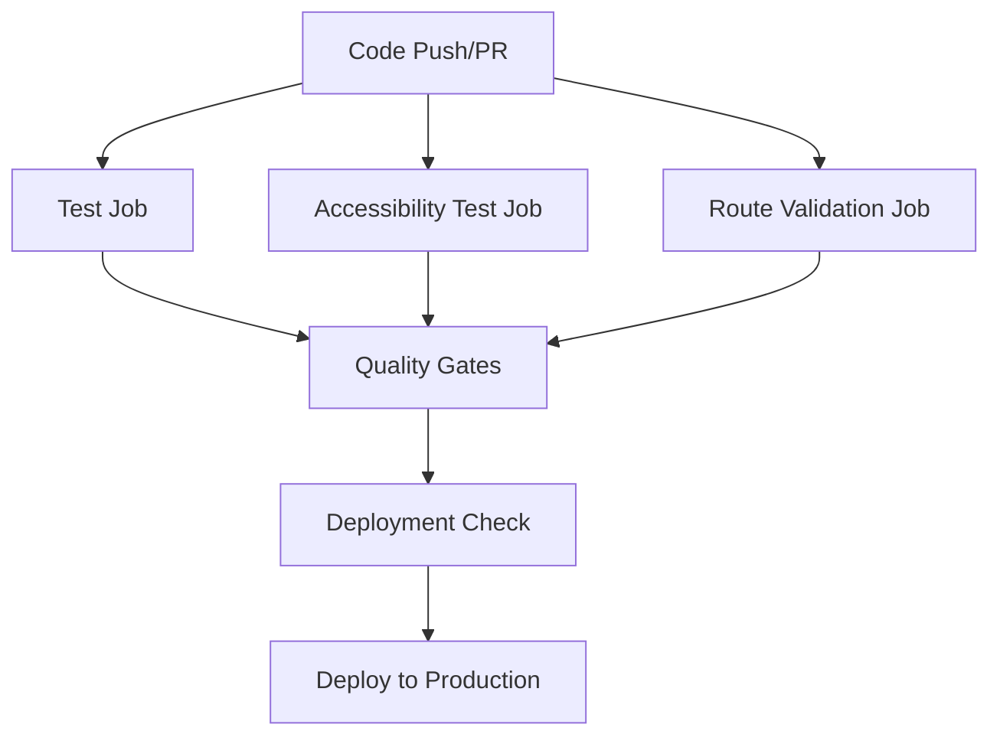

# CI/CD Pipeline Documentation

## Overview

This document describes the automated CI/CD pipeline setup for the EDT Research Website. The pipeline ensures code quality, runs comprehensive tests, and validates deployments.

## Pipeline Architecture

The CI/CD pipeline consists of multiple jobs that run in parallel and sequence:



## Jobs Description

### 1. Test Job (`test`)
**Purpose**: Core testing and build validation
**Runs on**: Node.js 18.x and 20.x matrix
**Steps**:
- Install dependencies
- Run TypeScript check (`npm run check`)
- Execute unit tests (`npm run test`)
- Generate coverage report (`npm run test:coverage`)
- Build project (`npm run build`)
- Validate build output

### 2. Accessibility Test Job (`accessibility-test`)
**Purpose**: RGAA 4.1 AA compliance validation
**Dependencies**: Requires `test` job to complete
**Steps**:
- Build project
- Install Playwright browsers
- Run accessibility tests with axe-core
- Validate WCAG 2.1 AA compliance

### 3. Route Validation Job (`route-validation`)
**Purpose**: Verify all routes are accessible
**Dependencies**: Requires `test` job to complete
**Steps**:
- Build and start preview server
- Test main routes (/, /en/, /fr/)
- Test all content pages
- Validate response codes

### 4. Quality Gates Job (`quality-gates`)
**Purpose**: Enforce quality standards
**Runs on**: Pull requests only
**Dependencies**: All previous jobs must pass
**Steps**:
- Check test coverage thresholds
- Validate code quality metrics
- Generate quality reports

### 5. Deployment Check Job (`deployment-check`)
**Purpose**: Production readiness validation
**Runs on**: Main branch only
**Dependencies**: All test jobs must pass
**Steps**:
- Production build validation
- Build artifact verification
- Deployment readiness confirmation

## Test Types

### Unit Tests
- **Location**: `src/test/utils/`, `src/test/content/`
- **Framework**: Vitest
- **Coverage**: Minimum 50% for all metrics
- **Purpose**: Test core functionality and business logic

### Integration Tests
- **Location**: `src/test/integration/`
- **Framework**: Vitest
- **Purpose**: Test component interactions and build processes

### Accessibility Tests
- **Location**: `src/test/e2e/accessibility.spec.ts`
- **Framework**: Playwright + axe-core
- **Standards**: RGAA 4.1 AA, WCAG 2.1 AA
- **Purpose**: Ensure accessibility compliance

### Route Tests
- **Location**: `src/test/e2e/routes.spec.ts`
- **Framework**: Playwright
- **Purpose**: Validate all routes return proper responses

## Configuration Files

### `vitest.config.ts`
- Configures unit and integration testing
- Sets up coverage reporting
- Excludes e2e tests from unit test runs

### `playwright.config.ts`
- Configures end-to-end testing
- Sets up multiple browser testing
- Configures test server integration

### `.github/workflows/ci.yml`
- Defines the complete CI/CD pipeline
- Configures job dependencies and matrix builds
- Sets up deployment conditions

## Coverage Requirements

### Current Thresholds
- **Branches**: 50%
- **Functions**: 50%
- **Lines**: 50%
- **Statements**: 50%

### Coverage Reports
- **Text**: Console output during CI
- **JSON**: Machine-readable format for tools
- **HTML**: Detailed visual report
- **Upload**: Codecov integration for tracking

## Quality Gates

### Automated Checks
- ✅ TypeScript compilation without errors
- ✅ All unit tests pass
- ✅ Build completes successfully
- ✅ Coverage meets minimum thresholds
- ✅ Accessibility tests pass
- ✅ Route validation succeeds

### Manual Review Required
- Code review for pull requests
- Content review for significant changes
- Security review for dependency updates

## Local Development

### Running Tests Locally
```bash
# Unit tests
npm run test

# Unit tests with coverage
npm run test:coverage

# Unit tests in watch mode
npm run test:watch

# End-to-end tests
npm run test:e2e

# All validation checks
./scripts/validate-ci.sh
```

### Pre-commit Checklist
- [ ] Run `npm run check` (TypeScript)
- [ ] Run `npm run test` (Unit tests)
- [ ] Run `npm run build` (Build validation)
- [ ] Test key routes manually
- [ ] Check accessibility with browser tools

## Deployment Process

### Automatic Deployment
- **Trigger**: Push to `main` branch
- **Condition**: All CI checks pass
- **Process**: Static site generation → Docker build → VPS deployment

### Manual Deployment
- **Trigger**: Manual workflow dispatch
- **Use case**: Hotfixes, rollbacks
- **Process**: Same as automatic with manual approval

## Monitoring and Alerts

### Build Status
- GitHub Actions status badges
- Email notifications on failure
- Slack integration (if configured)

### Performance Monitoring
- Build time tracking
- Test execution time
- Coverage trend analysis

### Error Tracking
- Failed test notifications
- Build failure alerts
- Deployment status updates

## Troubleshooting

### Common Issues

#### Tests Failing
1. Check TypeScript compilation: `npm run check`
2. Verify dependencies: `npm ci --legacy-peer-deps`
3. Check test isolation: Run individual test files
4. Review error logs in GitHub Actions

#### Build Failures
1. Check Astro configuration
2. Verify content collection schemas
3. Check for missing dependencies
4. Review build logs for specific errors

#### Accessibility Violations
1. Run axe-core locally: `npm run test:e2e`
2. Use browser accessibility tools
3. Check RGAA compliance guidelines
4. Review color contrast and keyboard navigation

#### Route Validation Failures
1. Check content file existence
2. Verify Astro routing configuration
3. Test routes locally: `npm run preview`
4. Review URL structure consistency

### Getting Help
- Check GitHub Actions logs for detailed error messages
- Review test output for specific failures
- Use local validation script: `./scripts/validate-ci.sh`
- Consult Astro documentation for framework-specific issues

## Maintenance

### Regular Tasks
- Update dependencies monthly
- Review and adjust coverage thresholds
- Update accessibility testing criteria
- Monitor build performance trends

### Quarterly Reviews
- Evaluate test effectiveness
- Update CI/CD pipeline configuration
- Review quality gate criteria
- Assess deployment process efficiency

## Security Considerations

### Dependency Management
- Regular security updates
- Vulnerability scanning
- License compliance checking
- Automated dependency updates (Dependabot)

### Secrets Management
- Environment variables for sensitive data
- GitHub Secrets for deployment keys
- No hardcoded credentials in code
- Regular secret rotation

### Access Control
- Branch protection rules
- Required status checks
- Review requirements for main branch
- Limited deployment permissions